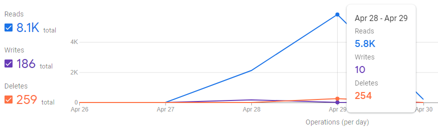

# [Project | weather-events](https://git.gvk.idi.ntnu.no/course/prog2005/prog2005-2021/-/wikis/Project-Description)

### Info
- Authors:
    - Sindre Eiklid (sindreik@stud.ntnu.no)
    - Rickard Loland (rickarl@stud.ntnu.no)
    - Susanne Skjold Edvardsen (susanse@stud.ntnu.no)
    - Maren Skårestuen Grindal (marensg@stud.ntnu.no)
- Root path:
    - Main:     localhost:8080/weather-rest/v1
    - Client:   *TBA*
- We have used these REST web services to build our service:
    - Weather information:  https://api.met.no/weatherapi/locationforecast/2.0/complete
    - Country information:  https://restcountries.eu/rest/v2/all
    - Holiday information:  https://date.nager.at/api/v2/PublicHolidays/
    - Location information: https://us1.locationiq.com/v1/
- You need to be connected to NTNU network with a VPN to run the program. If you want to run it locally, you will have to change the URL variable in the 'dict' package to ```http://localhost```.
- Client Repo: *TBA*

#### Plan

##### Original plan

Our original plan was to utilize the weather data from Yr's API and combine it with event-based APIs (concerts, holidays etc.) to let users get the weather report for that specific date and location. We planned to create three endpoints, where one of them is a webhook. The first endpoint gives a basic weather report, and the second compares the weather report from a base location with other locations. The webhook let users pass in a location and a holiday, and the service will return the weather report for that date

In addition to these endpoints, we planned to implement another webhook if there was enough time. This webhook allows users to register an event ID. It will then send the weather report from the location and date of the event.

##### What has been achieved

Initially, we struggled with finding an event-based API we could use for our event webhook, which was part of the reason it was only a "maybe" in our original plan. Eventually we figured out that Ticketmaster's API was free, and how to use it. Because of this, we were able to complete all of our planned endpoints.

In addition, we implemented some more webhooks. We made one with three different variations based on different input structures, which all had the same outcome. The three different options are default, holiday and ticket. Default takes a location and a date. Holiday, like stated in our original plan, takes a location and a holiday. The ticket option takes an event ID. The service sends a weather report for the date and location based on the frequency decided by the user. The frequency can be either ON_DATE or EVERY_DAY. ON_DATE only sends the weather report on the specific date, while EVERY_DAY sends the weather report every day starting 9 days before the date. Another webhook we implemented takes a location and a timeout. A weather report will then be returned based on these parameters.

#### Reflection

##### What went well

We designed our API to be easy to rewrite and repurpose. We have implemented helping functions and packages where it is fitting, and gclass methods for structs are quite numerous throughout the project.

Working in a group has worked out well. We have had regular meetings and a structured plan which made it easy to get things done. This worked especially well while working on retrieving data from our service endpoints, as everyone could work simultaneously without issue. For some more difficult work, we brainstormed solutions together during meetings while one person implemented and pushed the code. We did have occasional bottlenecks where some of us had to wait for someone else to finish, but there was always refactoring, readme improvements and other things to fix up. None of these lasted very long, so they did not present a challenge for the project as a whole.

Overall, we had a very smooth time with the project - we never got stuck on anything important, nor were we forced to abandon any functionality or compromise our execution of the project.

##### What went wrong

 One problem we encountered was risking exceeding the free firestore operation quota of 50K reads. We planned to store all of our data in firestore, but realized that each firestore query would read through every ID. This resulted in each query reading more than 200 times. We ended up using more than 16% of our free quota in 2 days, after fixing this we used less than 0.5% each day.



We encountered another problem when the work with calling webhooks started. When two different go routines read from a file at the same time, the program crashed. We tried to solve this by adding mutex locks. This lead to another problem, as we used two different mutex locks for the webhooks. This was solved by only having one collective mutex lock that we put in the 'dict' file.  

##### Experiences

One challenge we ran into was with the API we used to translate location names into geo-coordinates. Suddenly, a week before the deadline, we were starting to get wrong information from our geocoords handler. It was not consistent nor easily reproduced, yet it happened quite frequently. We struggled for a good our to figure out where our code was going wrong, until we realized the actual source-API - locationiq - was the problem.

To put it simply, when we pass a location into locationiq, it returns an array of up to ten locations matching the string we pass in, ordered from most 'important' to least. If there are more than ten, only the top ten will be returned. This is fine, and lets us get our locations in one of two ways - the simple way of just taking the first element in the array, and the theoretically more robust but also more cumbersome way of checking all returned locations and storing the one with highest importance. The problem was that for whatever reason, this endpoint will randomly just return one or two locations instead - and always among the lowest-importance locations as well. Leading to passing 'Oslo' in and having it spit out a location in the US. And since the issue is with the number of locations returned by locationiq, checking importance will not get us the data we need either.

While we could think of some 'solutions' to this issue - for example a function that looks at all locations stored with importance below a certain threshold, checking locationiq for new data every so often, and updating if one with greater importance is found - we didn't find this a worthwhile issue to work on for this project. For one, we are making a very roundabout and suboptimal solution to a problem in another API, which would be useless once that API is fixed. For another, this solution would get spammy for naturally low-importance locations that never update. We elected instead to explain it in the readme and leave it as is.

#### Learning experiences

One new thing we have learned while working on the project is caching, as none of us had any previous experience with it. We stored static data in files, and dynamic data in firestore. Already being familiar and knowing how to use firestore, definitely helped this experience. One challenge was knowing how long to keep the data for. In the end we ended up storing the geo coordinates and the Ticketmaster data for 12 hours before deleting it. The information about holidays are stored until the year changes, as some of the holidays are on different dates each year. We are overall happy with the result.

Another new learning experience was designing an API by ourselves. In the assignments we always got a task and the structure of the different endpoints. Doing this by ourselves was educational, as we had to put a lot of thought into the data structures and what information to return.

### Usage

1. Weather

    - Input:
        ```
        Method: GET
        Path: .../weather/location/{:location}
        ```

    - Output:
        ```go
        type Weather struct {
            Longitude float64 `json:"longitude"`
            Latitude  float64 `json:"latitude"`
            Location  string  `json:"location"`
            Updated   string  `json:"updated"`
            Data      struct {
                Now struct {
                    AirTemperature      float64 `json:"air_temperature"`
                    CloudAreaFraction   float64 `json:"cloud_area_fraction"`
                    DewPointTemperature float64 `json:"dew_point_temperature"`
                    RelativeHumidity    float64 `json:"relative_humidity"`
                    WindFromDirection   float64 `json:"wind_from_direction"`
                    WindSpeed           float64 `json:"wind_speed"`
                    WindSpeedOfGust     float64 `json:"wind_speed_of_gust"`
                    PrecipitationAmount float64 `json:"precipitation_amount"`
                } `json:"now"`
                Today struct {
                    Summary                    string  `json:"summary"`
                    Confidence                 string  `json:"confidence"`
                    AirTemperatureMax          float64 `json:"air_temperature_max"`
                    AirTemperatureMin          float64 `json:"air_temperature_min"`
                    PrecipitationAmount        float64 `json:"precipitation_amount"`
                    PrecipitationAmountMax     float64 `json:"precipitation_amount_max"`
                    PrecipitationAmountMin     float64 `json:"precipitation_amount_min"`
                    ProbabilityOfPrecipitation float64 `json:"probability_of_precipitation"`
                } `json:"today"`
            } `json:"data"`
        }
        ```

    - Example:
        - Input:
            ```
            Method: GET
            Path: localhost:8080/weather-rest/v1/weather/location/oslo
            ```
        - Output:
            ```json
            {
                "longitude": 10.74,
                "latitude": 59.91,
                "location": "Oslo, 0026, Norway",
                "updated": "29 Apr 21 11:20 CEST",
                "data": {
                    "now": {
                        "air_temperature": 9.2,
                        "cloud_area_fraction": 7,
                        "dew_point_temperature": -4.4,
                        "relative_humidity": 38.6,
                        "wind_from_direction": 57.8,
                        "wind_speed": 5.1,
                        "wind_speed_of_gust": 8.8,
                        "precipitation_amount": 0
                    },
                    "today": {
                        "summary": "fair_day",
                        "confidence": "certain",
                        "air_temperature_max": 12.2,
                        "air_temperature_min": 10.1,
                        "precipitation_amount": 0,
                        "precipitation_amount_max": 0,
                        "precipitation_amount_min": 0,
                        "probability_of_precipitation": 0
                    }
                }
            }
            ```

2. Compare

    - Input:
        ```
        Method: GET
        Path: .../weather/compare/{:location}/{:location1;location2;...}
        ```

    - Output:
        ```go
        type WeatherCompare struct {
            Longitude float64 `json:"longitude"`
            Latitude  float64 `json:"latitude"`
            Location  string  `json:"location"`
            Updated   string  `json:"updated"`
            Data         struct {
                Longitude float64 `json:"longitude"`
                Latitude  float64 `json:"latitude"`
                Location  string  `json:"location"`
                Updated   string  `json:"updated"`
                Now       struct {
                    AirTemperature      float64 `json:"air_temperature"`
                    CloudAreaFraction   float64 `json:"cloud_area_fraction"`
                    DewPointTemperature float64 `json:"dew_point_temperature"`
                    RelativeHumidity    float64 `json:"relative_humidity"`
                    WindSpeed           float64 `json:"wind_speed"`
                    WindSpeedOfGust     float64 `json:"wind_speed_of_gust"`
                    PrecipitationAmount float64 `json:"precipitation_amount"`
                } `json:"now"`
                Today struct {
                    AirTemperatureMax          float64 `json:"air_temperature_max"`
                    AirTemperatureMin          float64 `json:"air_temperature_min"`
                    PrecipitationAmount        float64 `json:"precipitation_amount"`
                    PrecipitationAmountMax     float64 `json:"precipitation_amount_max"`
                    PrecipitationAmountMin     float64 `json:"precipitation_amount_min"`
                    ProbabilityOfPrecipitation float64 `json:"probability_of_precipitation"`
                } `json:"today"`
            } `json:"data"`
        }
        ```

    - Example:
        - Input:
            ```
            Method: GET
            Path: localhost:8080/weather-rest/v1/weather/compare/oslo/bergen;stavanger
            ```
        - Output:
            ```json
            {
                "longitude": 10.74,
                "latitude": 59.91,
                "location": "Oslo, 0026, Norway",
                "updated": "29 Apr 21 11:20 CEST",
                "data": [
                    {
                        "longitude": 5.33,
                        "latitude": 60.39,
                        "location": "Bergen, Vestland, Norway",
                        "updated": "29 Apr 21 12:26 CEST",
                        "now": {
                            "air_temperature": 0.1,
                            "cloud_area_fraction": 11.3,
                            "dew_point_temperature": 1.3,
                            "relative_humidity": 3.8,
                            "wind_speed": -2.4,
                            "wind_speed_of_gust": -2.7,
                            "precipitation_amount": 0
                        },
                        "today": {
                            "air_temperature_max": -1.6,
                            "air_temperature_min": -0.1,
                            "precipitation_amount": 0,
                            "precipitation_amount_max": 0,
                            "precipitation_amount_min": 0,
                            "probability_of_precipitation": 0
                        }
                    },
                    {
                        "longitude": 5.71,
                        "latitude": 59.1,
                        "location": "Stavanger, Rogaland, Norway",
                        "updated": "29 Apr 21 13:09 CEST",
                        "now": {
                            "air_temperature": 1.9,
                            "cloud_area_fraction": 31.5,
                            "dew_point_temperature": 5.2,
                            "relative_humidity": 10.3,
                            "wind_speed": -3.3,
                            "wind_speed_of_gust": -0.6,
                            "precipitation_amount": 0
                        },
                        "today": {
                            "air_temperature_max": -0.1,
                            "air_temperature_min": 1.2,
                            "precipitation_amount": 0,
                            "precipitation_amount_max": 0,
                            "precipitation_amount_min": 0,
                            "probability_of_precipitation": 0
                        }
                    }
                ]
            }
            ```
3. weatherHook

    - Input:
        ```
        Method: GET
        Path: .../weather-rest/v1/notification/weather{?id=yourhook}
        ```

    - Output:
        ```go
        type WeatherHook struct {
            ID       string `json:"id"`
            Location string `json:"location"`
            Timeout  int64  `json:"timeout"`
            URL      string `json:"url"`
        }
        ```

    - Example:
        - Input:
            ```
            Method: GET
            Path: localhost:8080/weather-rest/v1/notification/weather?id=yourHookID
            ```
        - Output:
            ```json
            {
                "id": "yourHookID",
                "location": "Oslo",
                "timeout": 5,
                "url": "https://webhook.site/292d37f5-a017-4e07-8b62-2d8a4b9c3f94"
            }
            ```

    - Input:
        ```
        Method: POST
        Path: .../weather-rest/v1/notification/weather
        ```
        ```json
        Body:
           {
                "location": "Location of interest.",
                "timeout": 1,
                "url": "URL to pass data to."
            }
        ```

    - Output:
        ```go
        type WeatherHook struct {
            ID       string `json:"id"`
            Location string `json:"location"`
            Timeout  int64  `json:"timeout"`
            URL      string `json:"url"`
        }
        ```

    - Example:
        - Input:
            ```
            Method: POST
            Path: localhost:8080/weather-rest/v1/notification/weather
            ```
            ```json
            Body:
            {
                    "location": "Oslo",
                    "timeout": 5,
                    "url": "https://webhook.site/292d37f5-a017-4e07-8b62-2d8a4b9c3f94"
            }
            ```
        - Output:
            ```json
            {
                "status_code": 201,
                "message": "Webhook successfully created for 'https://webhook.site/292d37f5-a017-4e07-8b62-2d8a4b9c3f94'",
                "id": "ilX0vteqDlunPM1RZpXb"
            }
            ```

    - Input:
        ```
        Method: DELETE
        Path: .../weather-rest/v1/notification/weather{?id=yourhook}
        ```

    - Output:
        ```go
        type Debug struct {
            StatusCode 		 int    `json:"status_code"`
            Location   		 string `json:"location"`
            RawError   		 string `json:"raw_error"`
            PossibleReason   string `json:"possible_reason"`
        }
        ```

    - Example:
        - Input:
            ```
            Method: DELETE
            Path: localhost:8080/weather-rest/v1/notification/weather?id=yourHookID
            ```
        - Output:
            ```json
            {
                "status_code": 200,
                "location": "WeatherHook -> MethodHandler() -> weatherHook.HandlerGet() -> Deleting Webhook",
                "raw_error": "Webhook successfully deleted!",
                "possible_reason": "Unknown"
            }
            ```


## Notes

#### Design Decisions

##### Technologies used

The technologies we are going to use are Firestore, OpenStack and Docker. We are using firestore for caching. The weather data are stored for 6 hours. Whether or not the geocoords are stored depends on the importance of the selected location. If it has a low importance, it is stored for 3 hours. If the importance is high, it is saved in a file. The data about holidays are stored until the year change.

#### Structure

```
├──api
│   ├── countryData
│   │   ├── restCountries.go
│   │   └── structure.go
│   ├── diag
│   │   ├── diag.go
│   │   └── structure.go
│   ├── eventData
│   │   ├── eventData.go
│   │   ├── structure.go
│   │   └── ticketMaster.go
│   ├── geoCoordsData
│   │   ├── HandlerCoords.go
│   │   └── structure.go
│   ├── holidaysData
│   │   ├── holidays.go
│   │   └── structure.go
│   ├── notification
│   │   ├── weatherEvent
│   │   │   ├── methodHandler.go
│   │   │   ├── scheduler.go
│   │   │   ├── structure.go
│   │   │   └── weatherEvent.go
│   │   ├── weatherHook
│   │   │   ├── methodHandler.go
│   │   │   ├── scheduler.go
│   │   │   ├── structure.go
│   │   │   └── weather.go
│   │   └── feedback.go
│   ├── weather
│   │   ├── methodHandler.go
│   │   ├── structure.go
│   │   └── weather.go
│   ├── weatherCompare
│   │   ├── methodHandler.go
│   │   ├── structure.go
│   │   └── weatherCompare.go
│   ├── weatherData
│   │   ├── structure.go
│   │   ├── weatherData.go
│   │   └── yr.go
│   └── dataHandling
├── db
│   └── database.go
├── debug
│   └── errorHandler.go
├── dict
│   └── dictionary.go
├── fun
│   ├── math.go
│   └── sleep.go
├── .gitignore
├── ChangeLog.md
├── go.mod
├── go.sum
├── main.go
└── README.md
```

#### Error Handling

When an error is found, we add info to a debug struct with an Update struct function.
Debugging information is then sent to user as a json object, and printed to console with a Print function.

```go
type Debug struct {
	StatusCode       int    `json:"status_code"`     // The REST code for the error
	Location         string `json:"location"`        // Where in the program did the error occur
	RawError         string `json:"raw_error"`       // The raw error data
	PossibleReason   string `json:"possible_reason"` // Potential reasons for the error occurring (e.g. misspelled endpoint, etc)
}
```

#### Testing

*TBA*

#### Usage

##### Openstack
*TBA*

##### Run locally
1. Open terminal in directory
2. go build
3. go run main
4. Try our endpoints in postman!

##### Run tests
For Visual Studio Code with Golang extension:
1. Open testing file in the IDE
2. Click the ```run test``` label for any function that you want to test

##### Setup docker (linux version)
1. sudo docker build . -t 2005project
2. sudo docker run -d --name 2005container -p 8081:8080 2005project
3. When finished, try endpoints in postman on port 8081 (or change to your preferred port)